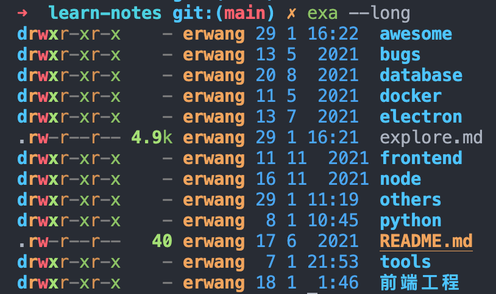
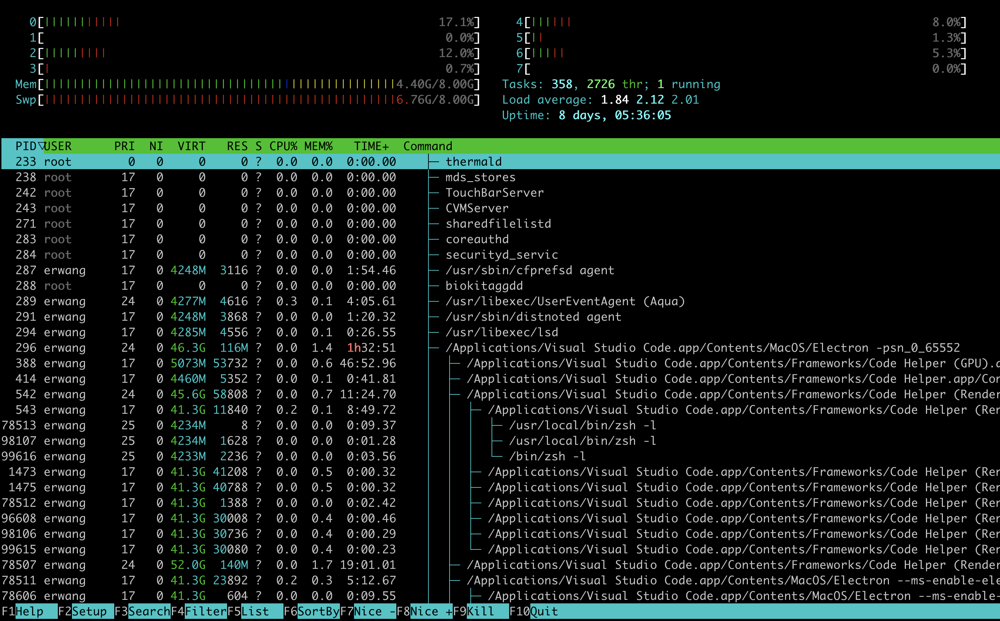
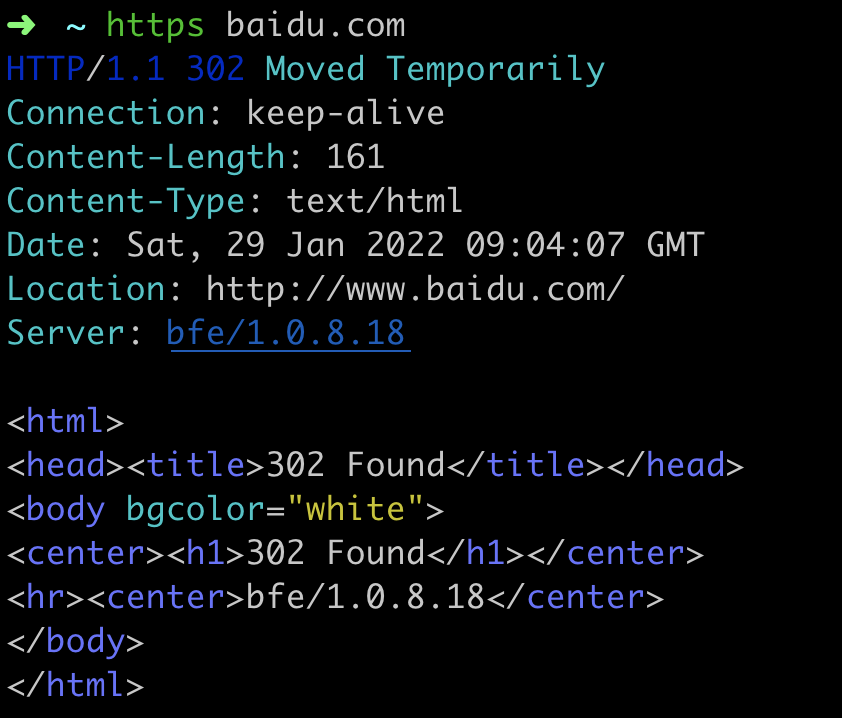

## 好用的命令行工具

### exa

[exa](https://github.com/ogham/exa) 是ls命令的替代品，可以彩色输出目录内容，更容易辨识。

```bash
# 用于代替 ll
exa --long
```



### z

[zoxide](https://github.com/ajeetdsouza/zoxide) 是 cd 命令的替代品，用来切换目录。

它的平常用法和 cd 一致，不过它有一个特点是部分匹配，可以只写路径的一部分，它自动找到最经常使用的匹配项。

比如，你经常用它进入目录/tmp，那么以后只要输入z t，它就会自动将t匹配为/tmp，从而进入该目录。

```bash
z t
```

### bat

[bat](https://github.com/sharkdp/bat) 是cat命令的替代品，输出文本文件的内容，并且带有cat所没有的代码高亮和行号。

```bash
bat README.md
```


### fd

`fd` 是find命令的替代品，用于文件名搜索。

它的用法比 `find` 更符合直觉。下面例子是搜索目录 `/tmp` 里面（包括子目录），所有含有 `dog` 的文件名。

```bash
# find 的写法
$ find /tmp -iname '*dog*'

# fd 的写法
$ fd dog /tmp
```

上面两条命令一比较，就会发现 `fd` 简单很多。

### htop

[htop](https://github.com/htop-dev/htop) 是 `top` 命令的替代品，用来显示系统的实时状态。

它带有高亮输出，并可以切换不同的选项卡（例如可以切换成进程树的形式查看）



### httpie

[httpie](https://github.com/httpie/httpie) 是 curl 的替代品，用来发出 HTTP 请求。

它的特点是语法更简单，并且服务器的返回内容会格式化高亮显示。



下面是发出 PUT 请求的例子：

```bash
# curl 的写法
$ curl -X PUT -d hello=world example.com

# httpie 的写法
$ http PUT example.com hello=world 
```

### 参考链接

- [阮一峰：命令行常用工具的替代品](https://www.ruanyifeng.com/blog/2022/01/cli-alternative-tools.html)
