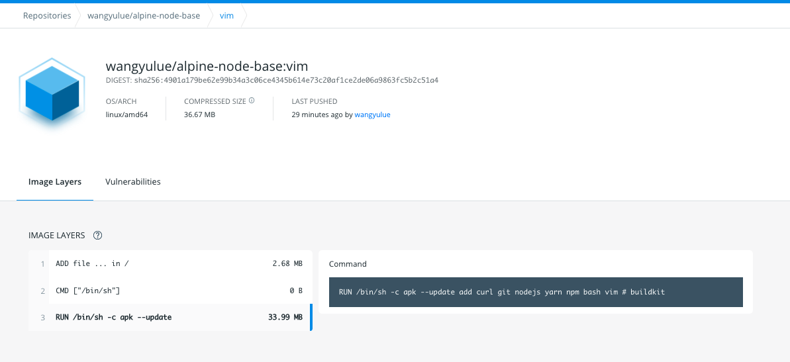

## 目的

在 github 上 push 时，docker hub 中的镜像可以自动更新

## 如何做

网址：[https://hub.docker.com](https://hub.docker.com)

### 第一步

在 setting -> Linked Account 上连接 github：

### 第二步

在 docker hub 上创建镜像：

并按下 `Create & Build` 按钮

### 第三步

切换到 Builds 页，可以看到 build 任务正在队列中：

过段时间，可以发现打包成功

Done! 之后每次 push 到 main 分支上，就会自动触发 docker hub 自动构建镜像

## 其他注意点

### 可以查看 Dockerfile 源文件

使用该方式可以清楚的看到 Dockerfile 原文件；使用命令行 `docker push` 的话，看不到 Dockerfile 原文件

以上自动构建可以看到 DockerFile

使用 docker push 的镜像看不到 DockerFile，但是可以看到每一层的信息（自动构建的也能看到每一层的信息）

### 使用自动构建打 tag 不太方便

但是自己使用的话， 打 tag 不是刚需
