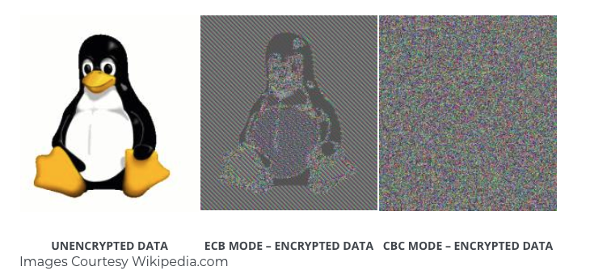

# node 的 crypto 模块

crypto 模块是对 OpenSSL 的封装，主要功能有 哈希、对称加密以及非对称加密。

下面是一些介绍。

## hash

`hash` 通常给数据签名，它是不可逆的。 hash 算法有很多种，取决于当前机器 OpenSSL 的版本。

```bash
# 查看 openssl 版本（以 Ubuntu 18.04 为例）
openssl version

# out:
# OpenSSL 1.1.1  11 Sep 2018
```

使用 `openssl list-message-digest-algorithms` 可以查看支持哪些 `hash` 算法：

```bash
openssl list-message-digest-algorithms

# out:
# DSA
# DSA-SHA
# DSA-SHA1 => DSA
# DSA-SHA1-old => DSA-SHA1
# DSS1 => DSA-SHA1
# gost-mac
# streebog512
# streebog256
# md_gost94
# MD4
# MD5
# MD5-SHA1
# RIPEMD160
# RSA-MD4 => MD4
# RSA-MD5 => MD5
# RSA-RIPEMD160 => RIPEMD160
# RSA-SHA1 => SHA1
# RSA-SHA1-2 => RSA-SHA1
# RSA-SHA224 => SHA224
# RSA-SHA256 => SHA256
# RSA-SHA384 => SHA384
# RSA-SHA512 => SHA512
# SHA1
# SHA224
# SHA256
# SHA384
# SHA512
# ...
```

常用的 `hash` 算法有 `md5`、`sha256`、`sha512`，下面是一些运算例子：

```js
const crypto = require("crypto");

function createHash(text, hashtype) {
  const hash = crypto.createHash(hashtype).update(text).digest("hex");
  console.log(hashtype, hash, hash.length);
}

['md5', 'sha256', 'sha512'].forEach((type) => {
  createHash("hello", type);
});

// out:
// md5 5d41402abc4b2a76b9719d911017c592 32
// sha256 2cf24dba5fb0a30e26e83b2ac5b9e29e1b161e5c1fa7425e73043362938b9824 64
// sha512 9b71d224bd62f3785d96d46ad3ea3d73319bfbc2890caadae2dff72519673ca72323c3d99ba5c11d7c7acc6e14b8c5da0c4663475c2e5c3adef46f73bcdec043 128
```

## Hmac

Hmac算法也是一种哈希算法，它可以利用 MD5 或 SHA256 等哈希算法，不同的是，Hmac 还需要一个密钥（俗称加盐）。

参考一个例子：

```js
const crypto = require("crypto");

const result = crypto.createHmac("md5", "123456").update("hello").digest("hex");

console.log(result);

// out:
// 9c699d7af73a49247a239cb0dd2f8139
```

为什么要加盐？ 因为相同密码的hash值是相同的，所以很容易通过彩虹表来破解密码（彩虹表可以简单理解为 明文->密文 的键值对），加盐后，破解的概率几乎为零。

## 对称加密

对称加密和前面的 hash 不同，它是可逆的。对称加密算法也有很多种，取决于当前机器 OpenSSL 的版本。

使用 `openssl list-cipher-commands` 可以查看支持哪些对称加密算法：

```bash
openssl list-cipher-commands

# out:
# aes-128-cbc
# aes-128-ecb
# aes-192-cbc
# aes-192-ecb
# aes-256-cbc
# aes-256-ecb
# base64
# bf
# bf-cbc
# bf-cfb
# bf-ecb
# bf-ofb
# camellia-128-cbc
# camellia-128-ecb
# camellia-192-cbc
# camellia-192-ecb
# camellia-256-cbc
# camellia-256-ecb
# ...
```

常见的对称加密算法有 `aes-256-cbc`。

crypto 模块中提供了 `createCipheriv` 和 `createDecipheriv` 来进行加密和解密的功能:

- `crypto.createCipheriv(algorithm, key, iv)`
- `crypto.createDecipheriv(algorithm, key, iv)`

这两个方法都接收 3 个参数：

- `algorithm`：加密解密的类型
- `key`: 加密解密的密钥
- `iv`: 初始向量

下面是一个例子：

```js
const crypto = require("crypto");

// 生成符合规范长度的密钥
function genkey(secret, length = 32) {
  return crypto.createHash('sha256').update(String(secret)).digest('base64').substr(0, length);
}

// 加密字符串
function encryptByAes256(content, secretkey, iv) {
  const cipher = crypto.createCipheriv('aes-256-cbc', genkey(secretkey), genkey(iv, 16));
  let enc = cipher.update(content, 'utf8', 'hex');
  enc += cipher.final('hex');
  return enc;
}

// 解密字符串
function decryptByAes256(content, secretkey, iv) {
  const decipher = crypto.createDecipheriv('aes-256-cbc', genkey(secretkey), genkey(iv, 16));
  let dec = decipher.update(content, 'hex', 'utf8');
  dec += decipher.final('utf8');
  return dec;
}

const encContent = encryptByAes256('hello', 'a', 'b');

console.log(encContent);

const decContent = decryptByAes256(encContent, 'a', 'b');

console.log(decContent);
```

注意 `createCipheriv` 和 `createDecipheriv` 对 key 和 iv 的长度有要求，所以上例子中用 `genkey` 做了一次转换。下面是 `AES` 算法对长度的具体要求（以 key 和 iv 都是字符串类型为例）：

|  算法类型   | key   | iv    |
|  ----  | ----  | ----  |
| aes128  | 16 | 16 |
| aes192  | 24 | 16 |
| aes256  | 32 | 16 |

另外，细心的同学会看到 `aes256` 具体有 `aes-256-cbc` 和 `aes-256-ecb` 两种算法。`aes-256-cbc` 算法相对更加安全，下面的图看出它们的区别：



## 非对称加密

我们刚才了解了下对称加密，即加密和解密用的都是相同的密钥。

非对称加密有一对密钥，公钥和私钥。公钥用来加密内容，然后私钥解密加密的内容。非对称加密有避免了私钥的传输，大大增加了安全性。

下面是 node 使用非对称性加密的例子：

1、创建一个私钥：

```bash
openssl genrsa -out rsa_private.key 1024
```

2、根据私钥创建对应的公钥：

```bash
openssl rsa -in rsa_private.key -pubout -out rsa_public.key
```

3、在 node 中使用：

```js
const crypto = require("crypto");
const fs = require("fs");

const pub_key = fs.readFileSync("./rsa_public.key");
const priv_key = fs.readFileSync("./rsa_private.key");

const text = "hello";

const secret = crypto.publicEncrypt(pub_key, Buffer.from(text));
const result = crypto.privateDecrypt(priv_key, secret);

console.log(secret); // buffer格式
console.log(result.toString()); 
```

## Diffie-Hellman

DH算法是一种密钥交换协议，它可以让双方在不泄漏密钥的情况下协商出一个密钥来。

<!-- todo -->

## 数字签名

数字签名基于非对称加密，过程与非对称加密的过程正好相反，是使用私钥进行加密签名，然后使用公钥进行解密的签名验证。

数字签名主要有如下作用：

- 验证发送者的身份
- 保证信息传输的完整性

想了解细节的同学可以看阮一峰的 [数字签名是什么？](http://www.ruanyifeng.com/blog/2011/08/what_is_a_digital_signature.html) 这篇文章。

下面是在 node 中使用数字签名的例子：

```js
const crypto = require("crypto");
const fs = require("fs");

const pub_key = fs.readFileSync("./rsa_public.key");
const priv_key = fs.readFileSync("./rsa_private.key");

const text = "hello";

// 生成签名
const sign = crypto.createSign("RSA-SHA256");
sign.update(text);
const signed = sign.sign(priv_key, "hex");

// 验证签名
const verify = crypto.createVerify("RSA-SHA256");
verify.update(text);
const verifyResult = verify.verify(pub_key, signed, "hex");

console.log("sign", signed); // 244ea5f09e474380669351d605c6868625daee6f35734859c30d1de9a1bc06f16359b198b1eb860e2ae9b42ecf591b473511f4a0243eed9ca1ebea7cabfd3d270a352ed752bbb95bc190a8d539538e19cb759162009fb984b3eb504ee02e7a182531dee16cb134b7c416767ff666a9f370aa09d394e15347087cedb074b5b695
console.log("verifyResult", verifyResult); // true
```

## 其他注意点

### 不同平台下的 md5 计算

#### mac

```bash
# 对字符串进行 md5
md5 -s hello

# 对文件进行 md5
md5 hello.md
```

#### ubuntu

```bash
# 对字符串进行 md5
echo -n hello | md5sum

# 对文件进行 md5
md5sum hello.md
```

上面的 `echo` 因为默认会加换行符，导致 `echo hello | md5sum` 这样写实际上 md5 的是 hello 加一个换行符，所以这里需要加 -n 忽略换行。

另外，用 vim 编辑文本默认也会折行，所以也会有以上的问题。

#### node

```js
const crypto = require('crypto');

const md5hash = crypto.createHash('md5')
  .update('hello')
  .digest('hex');
console.log(md5hash);
```

#### js

使用第三方模块 `md5` 、`js-md5` 或者 `crypto-js`：

```js
const md5_1 = require('md5')
const md5_2 = require('js-md5')
const md5_3 = require('crypto-js/md5')

console.log(md5_1('hello'));
console.log(md5_2('hello'));
console.log(md5_3('hello').toString());
```

## 最后

最后，再看一个讲密码学很好的入门视频[计算机科学速成课 p33 加密](https://www.bilibili.com/video/BV1EW411u7th?p=33)

## 参考文章

[How to use the crypto module](https://nodejs.org/en/knowledge/cryptography/how-to-use-crypto-module/)

[深入理解 node 中的 crypto 加密模块](https://zhuanlan.zhihu.com/p/126502869)

[Node.js的crypto (加密)模块](https://juejin.cn/post/6844903618382921735)

[数字签名是什么？](http://www.ruanyifeng.com/blog/2011/08/what_is_a_digital_signature.html)
