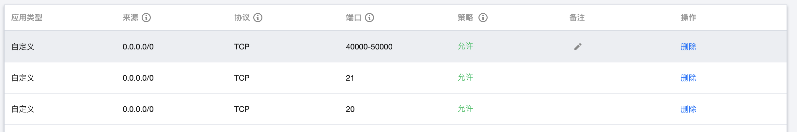

## ftp 是什么？

文件传输协议(File Transfer Protocol)，基于 TCP 的应用层协议。

FTP服务一般运行在 20 和 21 两个端口。端口 20 用于在客户端和服务器之间传输数据流，而端口 21 用于传输控制流。

## ftp 和 sftp 的区别？

ftp是一个文件传输服务，设计它的目的就是为了传输文件。它有独立的守护进程，使用20，21两个端口，20是数据链路的端口，21是控制链路的端。

sftp也是用来传输文件的，但它的传输是加密的，是ssh服务的一部分，没有单独的守护进程，是ssh服务的一部分，可以看做是ssh服务文件传输方案。和ssh一样，使用22端口。

## 如何使用

## 基础概念

- ftp 分客户端和服务端，客户端连接服务端来上传或者下载文件

### 第一步：安装 ftp 服务端

以 Ubuntu 18.04 为例：

```bash
sudo apt update
sudo apt install vsftpd
```

安装好后， ftp 服务就默认打开了， 使用 `systemctl status vsftpd` 可以查看服务状态。

### 第二步：打开相应防火墙

笔者使用的是腾讯云服务器， 所以需要在腾讯云控制台上打开相应端口； 20 和 21 端口是必须要开放的；另外，开发 40000-50000 端口（范围可以自行设置），以供 ftp 的被动模式使用。

> ftp 分主动模式和被动模式, 细节和区别可以自行了解



### 第三步：在系统中添加用户

```bash
adduser username
```

这时候会提示输入密码，输入密码后一路回车，一个用户就建好了。

### 第四步：修改 /etc/vsftpd.conf 配置文件

在 `/etc/vsftpd.conf` 中最下方添加如下配置：

```bash
pasv_min_port=40000
pasv_max_port=50000
```

注意这里和上面第二步中开放的端口对应。

修改好后，重新启动 ftp 服务：

```bash
systemctl restart vsftpd
```

### 第五步：测试登录

命令行登录：

```bash
ftp -p 159.138.136.159
# out
Connected to 159.138.136.159.
220 (vsFTPd 3.0.3)
Name (159.138.136.159:erwang): wanger
331 Please specify the password.
Password:
230 Login successful.
ftp>
```

也可以使用类似 Transmit 等图形化工具登录

## 其他

### mac 下安装 ftp 命令

#### 1、inetutils

可以使用 `inetutils`:

```bash
brew install inetutils
```

它是个套装，会安装 ftp 客户端和服务端，也会安装 telnet 客户端和服务端

#### 2、tnftp

也可以单独安装 ftp 客户端：

```bash
brew install tnftp
```

相应的，如果想安装 ftp 服务端，可以键入如下命令：

```bash
brew install tnftpd
```

### mac 下使用 ftp 图形化界面

#### 1、访达自带工具

路径是：

访达 -> 前往 -> 连接服务器

他的缺点是只能读，不能写

#### 2、Transmit

功能丰富，但是需要收费，网上可以找相应的破解版

### 设置 vsftpd 虚拟用户

有时候不想设置系统用户，这时候可以设置**虚拟用户**来使用 ftp。

有需求的同学可以参考链接[How to setup virtual users for vsftpd with access to a specific sub directory?](https://askubuntu.com/questions/575523/how-to-setup-virtual-users-for-vsftpd-with-access-to-a-specific-sub-directory)、[How to setup FTP server on Ubuntu 16.04 with virtual users](http://the7bits.com/blog/how-to-setup-ftp-server-on-ubuntu-16-04-with-virtual-users/)

> ps: 笔者太菜，尝试了一下没有成功设置虚拟用户

## 参考链接

[How To Set Up vsftpd for a User's Directory on Ubuntu 18.04](https://www.digitalocean.com/community/tutorials/how-to-set-up-vsftpd-for-a-user-s-directory-on-ubuntu-18-04)
